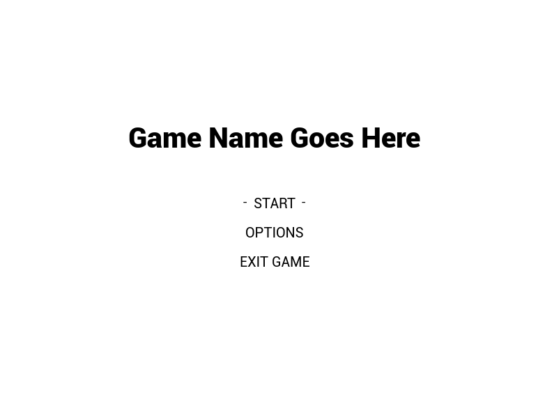
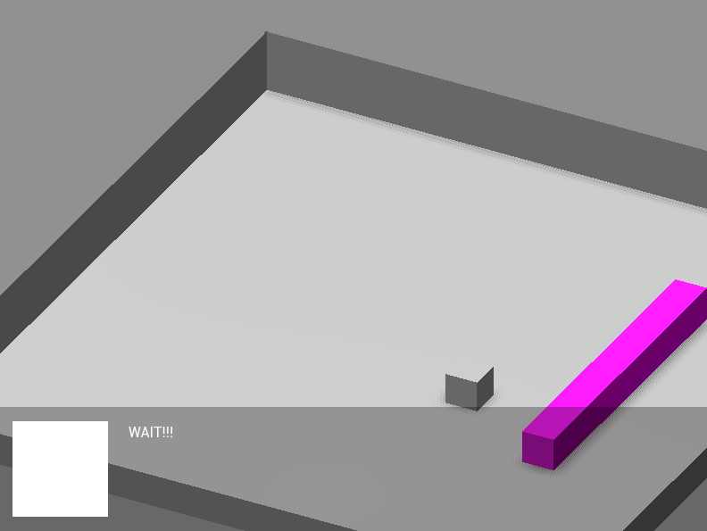
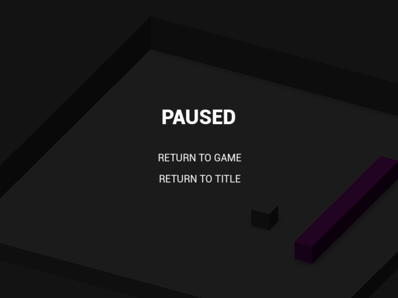
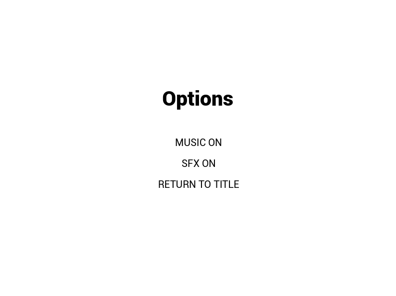

# Godot 4.1 Game jam template
A starting template with a few screens. Mostly takes care of logic for screen changes and a few small options like configuring sound and effects

Options to move around menus

Move a cube around and run into the death magenta cube for game over

Pause screen will pause game and lower volume with music as well

Turn on and off the sound effects and music for the game

Music taken from Free Music Archive
https://freemusicarchive.org/

